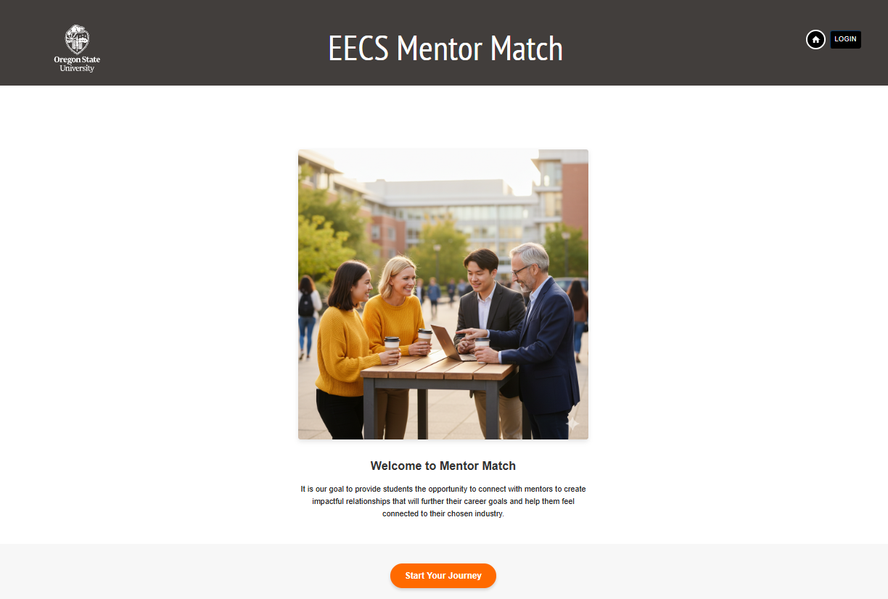
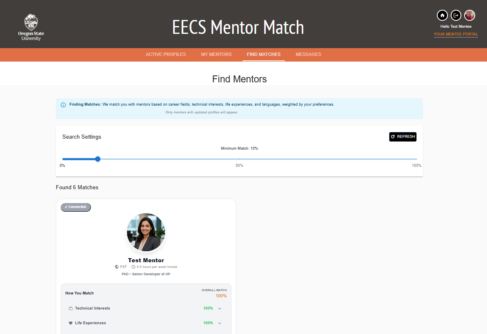
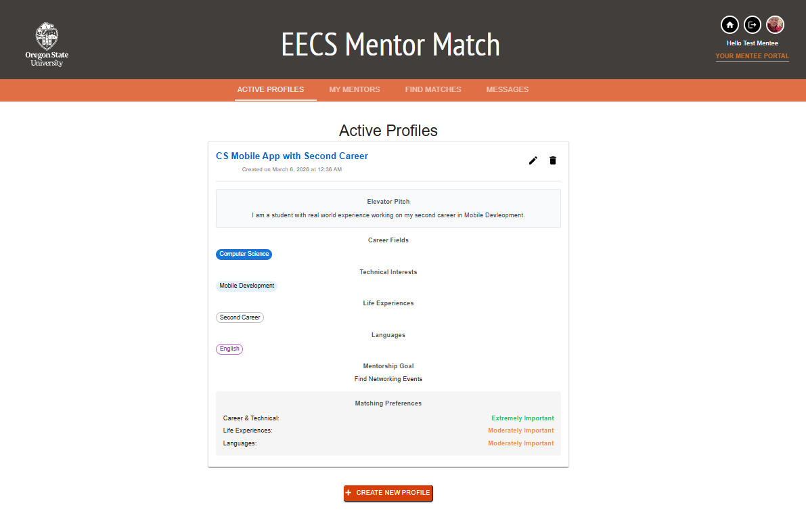
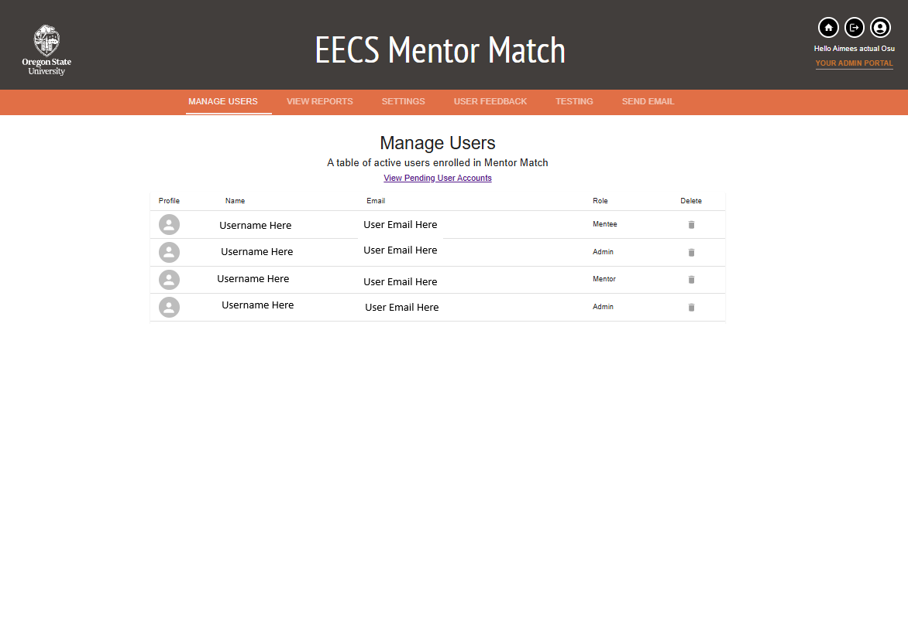

# 🎓 EECS Mentor Match

> *Connecting knowledge with ambition.*

A live, full-stack mentor-matching platform built for Oregon State University's EECS department as a year-long senior capstone project (CS 46X). Mentor Match connects OSU students, faculty, and industry partners through a weighted compatibility algorithm — making the mentorship matching process smarter, fairer, and more personal.

---

## 🌐 Live Demo

**[eecs-cop-mentor-matching-site.web.app](https://eecs-cop-mentor-matching-site.web.app/)**

> Currently in alpha — active user testing underway with real OSU students and faculty.

---

## 📸 Screenshots

### 🏠 Home Page
The landing page introducing the Community of Practice and the benefits of mentorship.

---

### 🔍 Find Matches
Algorithm-generated match results showing compatibility scores across career fields, technical interests, life experiences, and languages.

---

### 👤 Profile Card
Mentor and mentee profile cards displaying expertise, interests, and compatibility details.

---

### 🔐 Admin Portal
Admin dashboard for managing pending users, approving non-OSU accounts, and overseeing platform activity.

---

## ✨ Features

- **Smart Matching Algorithm** — Custom weighted compatibility scoring across career fields, technical interests, life experiences, and language preferences using a Ratio of Lesser Value approach with user-defined priority weighting
- **Four User Roles** — Separate portals for Mentors, Mentees, Both (mentor and mentee) and Admins with role-based access control
- **OSU Email Auto-Approval** — OSU email addresses are approved automatically; non-OSU users go through an admin approval workflow
- **In-App Messaging** — Secure, Firestore-powered messaging between matched users
- **Reusable Component Library** — Shared UI components across all portals (see [UI/UX Wiki](https://github.com/EECS-CoP-Mentor-Matching/Mentor-Matching-Site/wiki/UI-UX))
- **Admin Portal** — Pending user management, profile editing, and privilege management, home page review editing
- **Responsive Design** — Mobile-friendly interface built with Material UI

---

## 🛠️ Tech Stack

| Layer | Technology |
|-------|------------|
| Frontend | React, TypeScript, Material UI (MUI), Redux |
| Backend | Node.js, Firebase Cloud Functions |
| Database | Google Firestore (NoSQL) |
| Auth | Firebase Authentication (custom claims) |
| Hosting | Firebase Hosting |
| CI/CD | GitHub Actions → Firebase deploy |
| Language | TypeScript (92.5% of codebase) |

---

## 🧠 Matching Algorithm

The core matching engine scores mentor-mentee compatibility across three weighted categories:

- **Career & Technical Interests** (internal 75/25 split between career fields and technical skills)
- **Life Experiences**
- **Language Compatibility**

Each user sets their own priority weights (1–5) for each category. When weights differ, the algorithm applies a **50/25/25 priority split** favoring the highest-weighted category. When weights are equal, a simple average is used.

Scores are calculated using a **Ratio of Lesser Value** — measuring how well a mentor covers what a mentee is looking for, not just shared overlap. The algorithm also handles capacity limits, self-match prevention, and minimum threshold filtering.

---

## 🎥 Demo Videos

🎥 **[Watch Mentor Profile Setup](https://github.com/user-attachments/assets/5988a655-3238-432d-9bc3-d83402f2907c)**

🎥 **[Watch Mentee Profile Setup](https://github.com/user-attachments/assets/403cf0ff-de13-4910-8c0c-dd36e85f9432)**

---

## 📖 Documentation

| Page | Contents |
|------|----------|
| [Home](https://github.com/EECS-CoP-Mentor-Matching/Mentor-Matching-Site/wiki) | Project overview and goals |
| [User Guide](https://github.com/EECS-CoP-Mentor-Matching/Mentor-Matching-Site/wiki/User-Guide) | How to use the platform |
| [UI/UX](https://github.com/EECS-CoP-Mentor-Matching/Mentor-Matching-Site/wiki/UI-UX) | Wireframes, screenshots, and component library |
| [System Design](https://github.com/EECS-CoP-Mentor-Matching/Mentor-Matching-Site/wiki/System-Design) | Architecture and data model |
| [Developer Setup](https://github.com/EECS-CoP-Mentor-Matching/Mentor-Matching-Site/wiki/Developer-Setup-&-Project-Conventions) | Setup guide and coding conventions |
| [Release Plan & Notes](https://github.com/EECS-CoP-Mentor-Matching/Mentor-Matching-Site/wiki/Release-Plan-&-Notes) | Release history and roadmap |
| [Decision Log](https://github.com/EECS-CoP-Mentor-Matching/Mentor-Matching-Site/wiki/Decision-Log) | Key architectural decisions |

